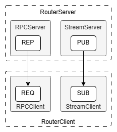
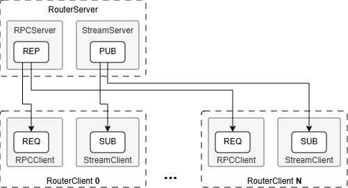
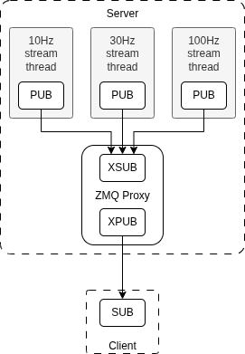

# one-liner 🐍 ⟵ 🚂 ⟵ 🐍
[](LICENSE)


a ZMQ-based Router pattern for interacting with remote python objects.

## High level features:
* Remote execution of Python code
* Streaming of periodically called functions with the ability to enable/disable them
* caching and queuing options for receiving only relevant data from `RouterClient`
* Multiple topologies supported between `RouterServer` and `RouterClient` communication including
  * between processes on the same PC
  * across multiple PCs.
  * Single `RouterServer`s to many `RouterClient`s.
  * Cascading `RouterServer`s: (i.e: a `RouterServer` can forward to another `RouterServer`).

## Why build this?
The router pattern provides a bridge between distinct applications.

For our use cases we mostly apply this pattern to separate instrument control code from its respective GUI.

This separation provides several advantages:
* GUIs can be developed independently of standalone projects.
* GUIs can run on separate processes or on different machines altogether, providing more flexibility where some machines are resource-constrained.
* Failures are siloed. A GUI can crash independent of the application code it is interfacing with.

Implementation-wise, this package acts as a lightweight wrapper around zmq, delegating most of the heavy-lifting to existing zmq solutions while hiding the messy details.
Interface-wise, this package tries not to commit the user to adopting a specific architecture and supports various ways of attaching existing code so it can be "routed" elsewhere.
**one_liner** place nicely in multi-threaded and multiprocessing-based Python projects.

## Package Installation with uv

To install and develop this package run:
```bash
uv sync
```

To install all optional dependencies to play with the examples, run:
```bash
uv sync --extra examples
```


## Package Installation with Pip

To install this package, in the root directory, run
```bash
pip install .
```

To install in editable mode, in the root directory, run:
```bash
pip install -e .
```
To install with supplementary dependencies for running the examples, run:
```bash
pip install -e .[examples]
```


## Quickstart

### Remote Function Execution
In the PC acting as the server:
```python
from one_liner.server import RouterServer
from threading import Event

class Horn:
  def beep(self):
    return "Boop!"
  
my_horn = Horn()

server = RouterServer(devices={"my_horn": my_horn})
server.run()

while True: # Nothing to do! Object control happens in another thread.
    Event().wait() # or time.sleep(SHORT_DELAY)
```

In the PC acting as the client:
```python
from one_liner.client import RouterClient

client = RouterClient()
result = client.call("my_horn", "beep") # call a func/method w/ args & kwargs; return the result.
```

### Streaming Data
There are three ways to stream data from a `RouterServer` to one or more `RouterClient` objects.

#### Periodic Broadcasting
In the PC acting as the server:
```python
from one_liner.server import RouterServer
import cv2

video = cv2.VideoCapture(0) # Get the first available camera.

def get_frame():
  return video.read()[1] # just get the frame.

server = RouterServer()
server.add_stream("live_video", # name of the stream
                  30,  # How fast to call this function.
                  get_frame) # func to call (no *args or **kwargs in this case).
server.run(run_in_thread=False)  # block, but we can not-block if set to True. That's it!
```

In the PC acting as the client:
```python
from one_liner.client import RouterClient
import cv2
import zmq

client = RouterClient()
client.configure_stream("live_video")

while True:
    try:
        timestamp, frame = client.get_stream("live_video")
    except zmq.Again:
        continue
    cv2.imshow("live_video from RouterServer", frame)
    cv2.waitKey(1) # Required short wait (1-ms).
```

That's it!


#### Application-Controlled
Instead of having `RouterServer` periodically call a function in a thread, it's also possible to have your native application send data.

In the PC acting as the server:
```python
from one_liner.server import RouterServer
import cv2

video = cv2.VideoCapture(0) # Get the first available camera.

server = RouterServer()
send_frame = server.get_broadcast_fn("live_video")
server.run()  # don't block.

while True:
    send_frame(video.read()[1])  # Read and send camera frames as fast as possible.
```

In the PC acting as the client--there are no changes!
It's just the same example client code as before.

#### from another zmq socket
**TODO**: see the examples folder for now.

### Handling Received Data

There are two ways to handle received data:
If you need every message, use `'queue'`, where messages will fill up an internal client-side FIFO buffer.
If you only need to work off of the latest message, use `'cache'`, where only the most recently available message will be available on the client side.
In the PC acting as the client:
```python
client = RouterClient()
client.configure_stream("live_video", storage_type="cache")  # or 'queue' (default)
```
### Controlling Data Streams
Streamed data can be enabled or disabled such that messages from the server will or will not be sent to all clients for a given stream.
To do this, simply enable or disable an existing stream by name:
```python
client.enable_stream("live_video")  # the connected Router will not send this strea 
# ...
client.disable_stream("live_video")  # the connected Router will send the stream
```

## Implementation Details

### Bird's Eye View
High level, the `RouterServer` and `RouterClient` support two ways of sending and receiving data remotely.

<div align="center">

</div>

It is also OK to connect multiple `RouterClient`s to a single `RouterServer` like so:
<div align="center">

</div>


> [!WARNING]
> There are no restrictions for connecting multiple clients at this level.
> Any restrictions or limitations on what functions can be called when multiple clients are connected needs to be applied at a higher level.


### Streamer
Streaming is done by aggregating all calls of the same frequency and creating one thread per frequency.
Streaming using threads simplifies the problem of scheduling when certain functions would be call using strategies like a priority queue.
Because sockets are explicitly _not_ threadsafe, each streamer thread instead creates its own PUB socket.
To simplify connections on the client side, streams are aggregated together through a single socket such that the client only needs to know one address.
Socket-to-socket communication is done using zmq's same-process shared memory implementation (`inproc`).
Creating this proxy makes the system threadsafe.

<div align="center">

</div>

### Relaying data from another ZMQ Socket

It's also possible to stream data from an existing zmq socket (including another `RouterServer`).
This is done with a zmq proxy.

<div align="center">

</div>

By relaying data from a completely separate zmq socket, it is possible to cascade `RouterServer`s.

## Package/Project Management

This project utilizes [uv](https://docs.astral.sh/uv/) to handle installing dependencies as well as setting up environments for this project. It replaces tool like pip, poetry, virtualenv, and conda.

This project also uses [tox](https://tox.wiki/en/latest/index.html) for orchestrating multiple testing environments that mimics the github actions CI/CD so that you can test the workflows locally on your machine before pushing changes.

## Documentation
### Environment Setup
To install with supplementary dependencies for creating local docs, run:

With uv:
```bash
uv sync --extra docs
```
with pip:
```bash
pip install -e .[docs]
```

### Building the Docs
To generate the rst files source files for documentation from this directory, run
```bash
uv run sphinx-apidoc -o docs/source/ src
```
Then, to create the documentation HTML files, run
```bash
uv run sphinx-build -b html docs/source/ docs/_build/html
```

<!--
## Code Quality Check

The following are tools used to ensure code quality in this project.

- Unit Testing

```bash
uv run pytest tests
```

- Linting

```bash
uv run ruff check
```

- Type Check

```bash
uv run mypy src/mypackage
```
-->
