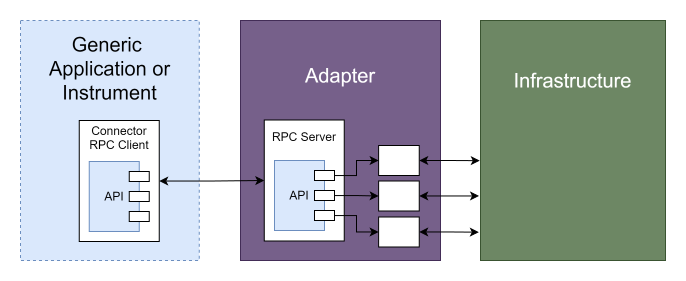

# Adapter Protocol Example

This example shows a pattern (with three implementation examples) that can be used to decouple generic code (e.g. for running an instrument) from infrastructure-specific code (e.g. querying external databases).

## Usage
Run the example with `uv run examples/rpc/adapter/instrument.py`, it'll start the adapter automatically in a subprocess.

## Description

The Instrument code defines a [Protocol](https://typing.python.org/en/latest/spec/protocol.html) and models that it will use to communicate, then uses the three techniques provided from `instrument_utils.py` to set up an RPC client to broadcast the function calls over zmq.

In a separate application, an Adapter is written that imports the API from the main instrument and implements the specific logic to carry out the desired functions. It runs a RPC server that connects to the instrument.

`instrument_utils.py` contains three ways of making a concrete connector object that implements the api methods with calls through an RPC client. Each of these techniques also accepts a command to run in a subprocess, allowing the instrument to be configured with a path to run the adapter. Instantiating the connector starts a subprocess with the adapter, so the instrument can always expect the server to be running. The connector object is also fully type-hinted and supports IDE autocomplete.

## 

This essentially allows dependency injection, where the injected code can be in its own repository and can be deployed and run completely separately from the generic instrument or application.
